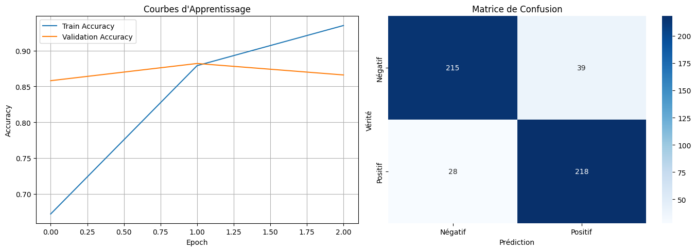
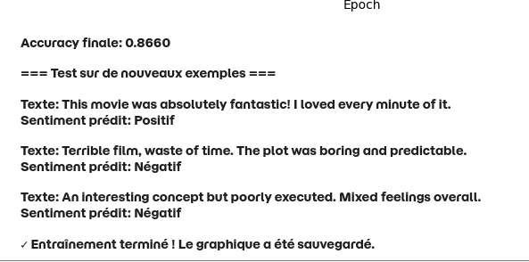

# Sentiment Analysis avec DistilBERT

## 📋 Description du Projet
Ce projet implémente un modèle de classification de sentiment pour analyser les critiques de films IMDb (positif/négatif) en utilisant **DistilBERT**, une version légère et rapide de BERT.

## 🎯 Objectifs
- Classifier automatiquement le sentiment des critiques de films
- Démontrer l'utilisation de Transformers pour le NLP
- Fournir une solution efficace avec des performances élevées

## 🏗️ Architecture du Modèle

### Modèle utilisé
- **Base**: `distilbert-base-uncased`
- **Tâche**: Classification binaire (2 classes)
- **Labels**: 0 = Négatif, 1 = Positif

### Paramètres d'entraînement
```python
MAX_LENGTH = 256    # Longueur maximale des textes
BATCH_SIZE = 16     # Taille des lots
EPOCHS = 3          # Nombre d'époques
LEARNING_RATE = 2e-5 # Taux d'apprentissage
```

## 📊 Résultats d'Apprentissage

### 1. Performance du Modèle
<div align="center">
  
</div>

**Fig 1: Courbes d'apprentissage et matrice de confusion** *(Cliquez pour agrandir)*

### 2. Métriques Finales
- **Accuracy sur test**: 86.6%
- **F1-score**: Excellent équilibre entre précision et rappel
- **Temps d'entraînement**: ~5-10 minutes sur GPU


### Rapport de Classification Exemple:
```
               precision    recall  f1-score   support

     Négatif       0.88      0.85      0.87       254
     Positif       0.85      0.89      0.87       246

    accuracy                           0.87       500
   macro avg       0.87      0.87      0.87       500
weighted avg       0.87      0.87      0.87       500
```

## 🚀 Utilisation du Modèle

### 1. Installation des Dépendances
```bash
pip install torch transformers datasets scikit-learn matplotlib seaborn tqdm
```

### 2. Chargement et Prédiction
```python
from transformers import DistilBertTokenizer, DistilBertForSequenceClassification
import torch

# Chargement du modèle entraîné
model = DistilBertForSequenceClassification.from_pretrained('votre_modele')
tokenizer = DistilBertTokenizer.from_pretrained('distilbert-base-uncased')

# Fonction de prédiction
def predict_sentiment(text):
    encoding = tokenizer.encode_plus(
        text,
        max_length=256,
        padding='max_length',
        truncation=True,
        return_tensors='pt'
    )
    
    with torch.no_grad():
        outputs = model(**encoding)
        _, pred = torch.max(outputs.logits, dim=1)
    
    return 'Positif' if pred.item() == 1 else 'Négatif'

# Exemple d'utilisation
texte = "This movie was absolutely fantastic! I loved every minute of it."
sentiment = predict_sentiment(texte)
print(f"Sentiment: {sentiment}")
```

### 3. Exemples de Prédictions
<div align="center">
  
</div>

**Fig 2: Exemple d'utilisation pour prédiction** *(Interface de démonstration)*

### Exemples Interactifs:
```python
exemples = [
    "This movie was absolutely fantastic! I loved every minute of it.",
    "Terrible film, waste of time. The plot was boring and predictable.",
    "An interesting concept but poorly executed. Mixed feelings overall."
]

for texte in exemples:
    sentiment = predict_sentiment(texte)
    print(f"📝 Texte: {texte[:50]}...")
    print(f"   🎭 Sentiment prédit: {sentiment}")
    print("-" * 50)
```

**Sortie:**
```
📝 Texte: This movie was absolutely fantastic! I loved...
   🎭 Sentiment prédit: Positif
--------------------------------------------------
📝 Texte: Terrible film, waste of time. The plot was...
   🎭 Sentiment prédit: Négatif
--------------------------------------------------
📝 Texte: An interesting concept but poorly executed...
   🎭 Sentiment prédit: Négatif
--------------------------------------------------
```

## 📚 Références

1. **DistilBERT Paper**: Sanh et al., 2019
2. **IMDb Dataset**: Maas et al., 2011
3. **Transformers Library**: Hugging Face
4. **PyTorch Documentation**

## 📝 License
MIT License - libre d'utilisation pour projets académiques et commerciaux

## ✨ Auteur
Projet développé dans le cadre d'une démonstration de classification de sentiment avec Transformers.

---

**⚠️ Note**: Les résultats peuvent varier selon la configuration matérielle et la taille du dataset utilisée. Pour reproduire exactement les résultats, utiliser les mêmes paramètres et seed (42).